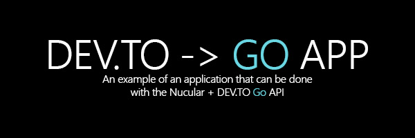
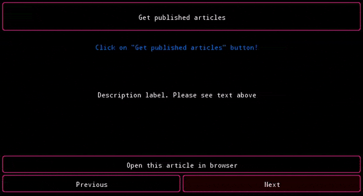

  

# godevto-app
**Code quality**: 

Example GUI app builded on Nucular (using hugmouse/godevto)

## Application demo

## Releases
Application is available for many platforms: 

You can download releases here: [godevto-app/releases](github.com/hugmouse/godevto-app/releases)